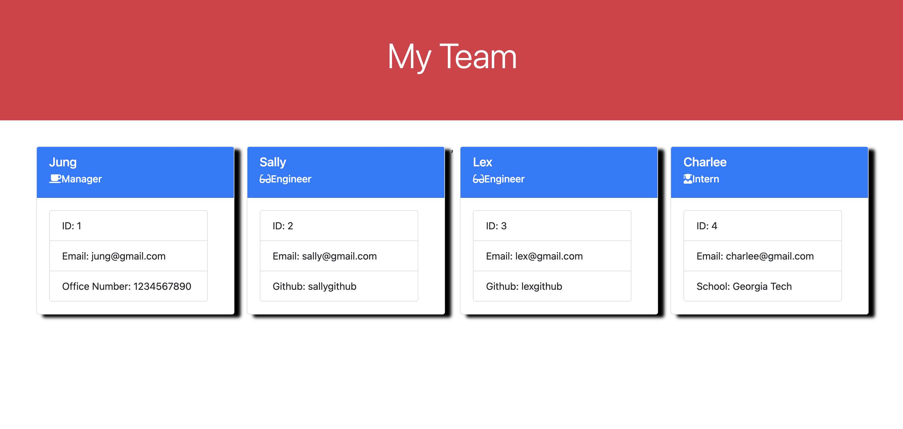

# Team-Profile-Generator

## Description
This is a team profile generator. It uses nodeJS and inquirer to create a unique HTML and CSS based upon the user's criteria and team member information.
## Installation
Download this from my github

## Usage
To use this application, ensure that the inquirer8.2.4 is downloaded, and jest to test. Run the command "node index.js"  and follow the prompts. At the end an HTML and CSS will be written to the Dist folder.

## Credits
N/A

## License
N/A

## Link to Video of Walkthrough and sampleHTML and sampleCSS
[Link to Samples and Walkthrough](https://drive.google.com/drive/folders/1R6zKV_xW-n9e5bdvkogPJ6lLyDpetmKr?usp=sharing)
